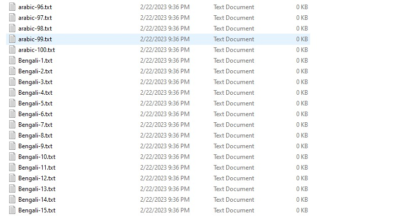
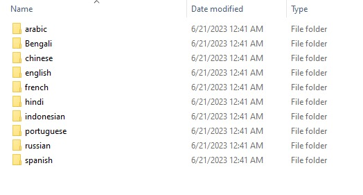
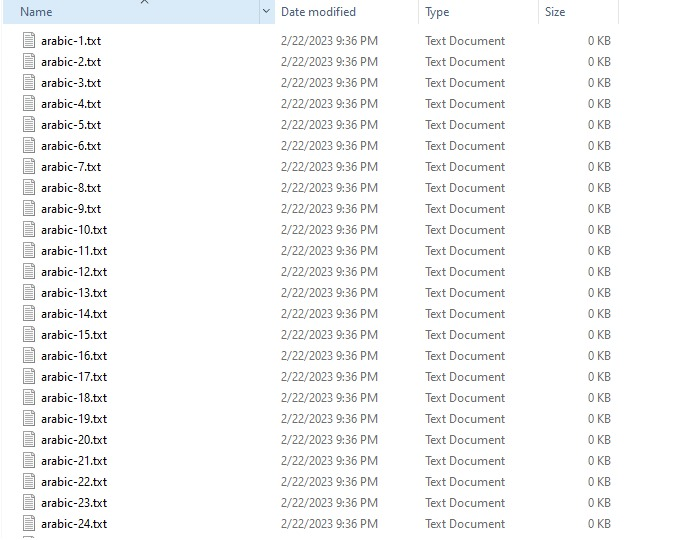

# File Grouping Program

## Description

This program is designed to help you organize your files by grouping them into sub-folders based on their common language. The program scans a specified directory and categorizes the files based on prefix of file name ( ex: arabic-1.txt, arabic-2.txt, ... to
arabic-100.txt, english-1.txt, english-2.txt, ... to english-100.txt …etc). Each sub-folder created will be named after its common language name.
## Running Program

Add folder one-k-files-main downloaded from the following repository https://github.com/Tamatem-Plus/one-k-files to the project path
run the program using the following script when in the same directory of the project
```
python sort_files.py
```

## Before running
  

## After running
  
  
